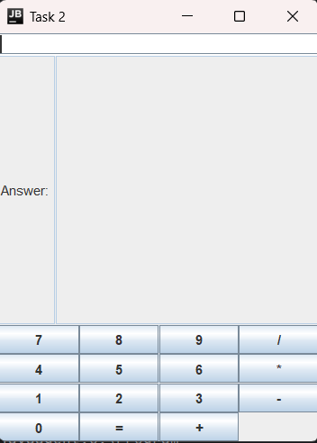

# Simple Calculator GUI Application

## 📝 Description
**Task2** is a basic Java Swing application that implements a simple calculator. It allows users to perform basic arithmetic operations like addition, subtraction, multiplication, and division using an intuitive graphical user interface.

---

## 🚀 Features
- Perform basic arithmetic operations: **Addition (+)**, **Subtraction (-)**, **Multiplication (\*)**, and **Division (/)**.
- Simple and clean graphical user interface using **Java Swing**.
- Input field for number entry and a dedicated result display.
- Responsive buttons for numeric input and operations.

---

## 🖥️ Technologies Used
- **Java Swing**: For creating the graphical user interface.
- **AWT (Abstract Window Toolkit)**: For event handling and layout management.

---

## 📸 Screenshot


---

## 🛠️ How to Run
1. Clone this repository:
   ```bash
   git clone https://github.com/your-username/task2-calculator.git
   ```
2. Navigate to the project directory:
   ```bash
   cd task2-calculator
   ```
3. Compile the Java program:
   ```bash
   javac Task2.java
   ```
4. Run the application:
   ```bash
   java Task2
   ```

---

## 🧮 How to Use
1. **Enter Numbers**: Use the numeric buttons (`0-9`) to input numbers in the input field.
2. **Choose an Operation**: Click one of the operation buttons (`+`, `-`, `*`, `/`) to select an operation.
3. **Get Results**: Press the `=` button to calculate and display the result in the result field.
4. **Reset for New Calculation**: Input a new number and start over.
